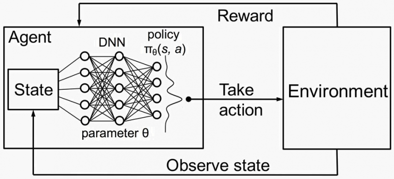

# Deep Q-Network (DQN) Reinforcement Learning for Stock Trading

## Overview

Welcome to the Deep Q-Network (DQN) Reinforcement Learning for Stock Trading self-project! This project aims to demonstrate how to apply Deep Q-Networks, a popular Reinforcement Learning algorithm, to develop an autonomous stock trading agent. Reinforcement Learning allows an agent to learn optimal actions through trial and error, making it well-suited for dynamic and uncertain environments like the stock market.

The project will utilize OpenAI Gym, a popular Python library, to create a custom trading environment. OpenAI Gym provides a simple and flexible interface to define and interact with various environments, making it a perfect choice for our stock trading scenario.

In this project, we will implement a DQN model that learns to make buy/sell/hold decisions based on historical stock price data. The agent will learn to maximize cumulative returns over time, effectively learning a trading strategy that adapts to market conditions.

## Trading environment

The trading environment provides the following features:

- Observation Space: The observation space contains relevant information about the stock market, such as price movements, volume, and technical indicators.

- Action Space: The action space defines the actions that an agent can take, like buying, selling, or holding a particular stock.

- Rewards: The environment provides rewards based on the performance of the trading strategy. Positive rewards are given for profitable trades, and negative rewards are given for losing trades.

## Prerequisites

To run this project, you will need the following dependencies:

- Python 
- TensorFlow  or PyTorch 
- OpenAI Gym
- NumPy 
- pandas 
- Matplotlib 

### Results

Plot of the random agent simulation compared to the stock return

Deep Q-Network runs on BAUTO stock in KLSE (Malaysia Stock Exchange) over 1500 episodes.

DoubleDeep Q-Network runs on BAUTO stock in KLSE (Malaysia Stock Exchange) over 1500 episodes.

